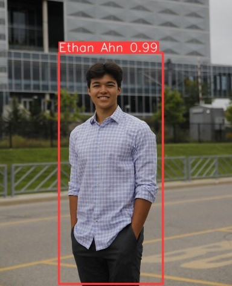

<h1 align="center">
"Hello World!" I'm Ethan Ahn 👋
</h1>

<div align="center">

[](https://www.linkedin.com/in/ethanahn/)
[](mailto:ethan@tower10labs.com)
</div>



<div align="center">
<a href="https://git.io/typing-svg"></a>
</div>

<hr>


```
💻 Prev Software Developer @ RBC
----------------------------------
👨‍💻 Studying as a Mechatronics Engineering Student @ UWaterloo
⭐ Aspiring Machine Learning and Autonomous Robotics Engineer
🔥 Passionate about Autonomous Robotics
🔭 Currently working on LLMs and Personal Assistants
🌱 Learning about Machine Learning and AR
✅ Main Languages: Python, C++, Java
```

<hr>

<h3 align="center">
Languages 💻 
</h3>

<div align="center">


</div>

<hr>

<h3 align="center">
Frameworks and Libraries 📚
</h3>

<div align="center">


</div>

<hr>

<h3 align="center">
Databases and Cloud 🗃️
</h3>

<div align="center">


</div>

<hr>

<h3 align="center">
Tools and More 🛠️
</h3>

<div align="center">


